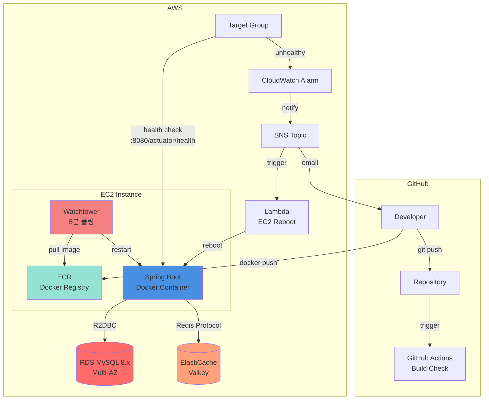

# 🎭 Mafia Game Server

WebFlux + Redis 기반 실시간 마피아 게임 서버 (8인, WebSocket)

## 🛠 Tech Stack

- **Java 21** + **Spring Boot 3.5.6** + **WebFlux** (비동기/논블로킹)
- **MySQL 8.x** (R2DBC) + **AWS RDS**
- **REDIS (AWS ElastiCache valkey)** - 상태 캐싱, 분산 락, Pub/Sub
- **WebSocket** - 실시간 양방향 통신
- **Docker** + **AWS ECR** + **Watchtower** (5분 폴링 자동 배포)

## 🏗 Architecture

```
Client (WebSocket + REST)
    ↓
Controller → WebSocket Handler
    ↓
Service (GameScheduler: 페이즈 자동 전환)
    ↓
Redis (Cache + Lock + Pub/Sub) + MySQL (R2DBC)
```

**핵심 레이어**
- **WebSocket Handler**: 실시간 메시지 라우팅, Redis Pub/Sub 브로드캐스팅
- **GameSchedulerService**: 이벤트 기반 페이즈 자동 전환
- **Cache/Lock Layer**: 게임 상태 캐싱, 분산 락 동시성 제어

## 🔄 Data Management

### MySQL (영속성)
- users, rooms, games, chat_messages

### Redis (휘발성 + 동시성)
```
game:state:{gameId}                    # 게임 상태 캐싱 (TTL: 30분)
vote:{gameId}:{dayCount}:{phase}       # 투표 집계
lock:{resourceKey}                     # 분산 락 (SETNX, TTL: 10초)
Pub/Sub: room:{roomId}, game:{gameId}  # 실시간 브로드캐스트
```

### 투표 처리 플로우
```
Client → WebSocket
  ↓
GameService.vote()
  ├─ RedisLock.acquire()         # 분산 락
  ├─ VoteCache.add()             # Redis 저장
  ├─ GameActionRepo.save()       # MySQL 기록
  └─ RedisPubSub.publish()       # 브로드캐스트
  ↓
GameScheduler (페이즈 종료)
  ├─ VoteCache.aggregate()       # 과반수 집계
  └─ GameService.transitionPhase()
```

## ☁️ AWS Infrastructure



### 핵심 구성
- **배포**: GitHub → ECR → Watchtower (5분 폴링) → 자동 재시작
- **컴퓨팅**: EC2 (Docker)
- **데이터**: RDS MySQL 8.x (Multi-AZ) + ElastiCache Valkey
- **모니터링**: CloudWatch Alarm → SNS → Lambda (자동 재부팅)

## 🚀 Local Setup

```bash
# 1. 의존성 실행 (MySQL, Redis)
docker-compose up -d

# 2. DB 초기화
mysql -h localhost -P 3307 -u root -p < init_database.sql

# 3. 실행
./gradlew bootRun
```

## 📚 API Docs

`http://localhost:8080/swagger-ui.html`
